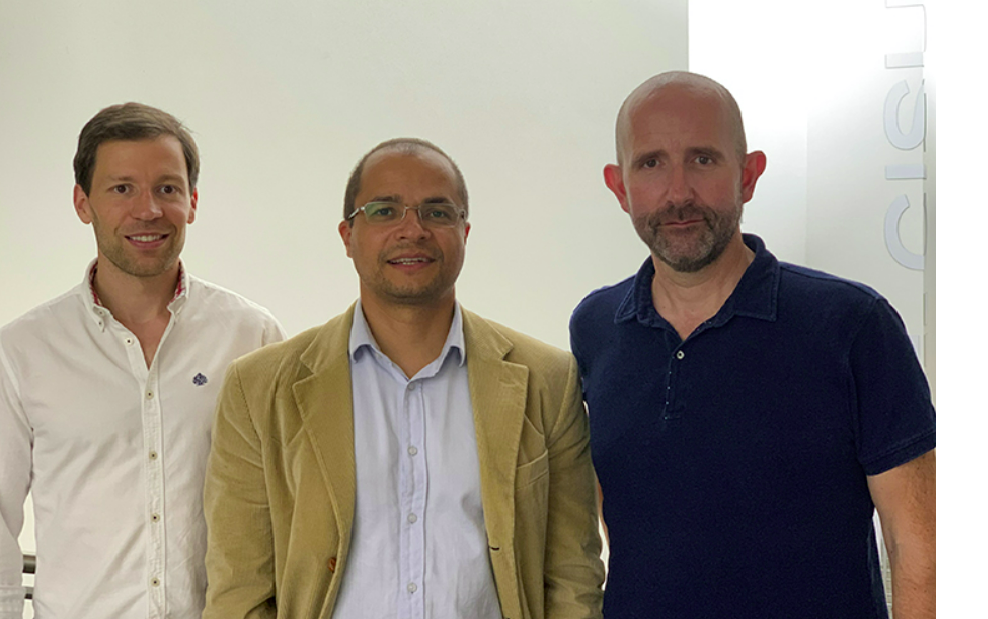
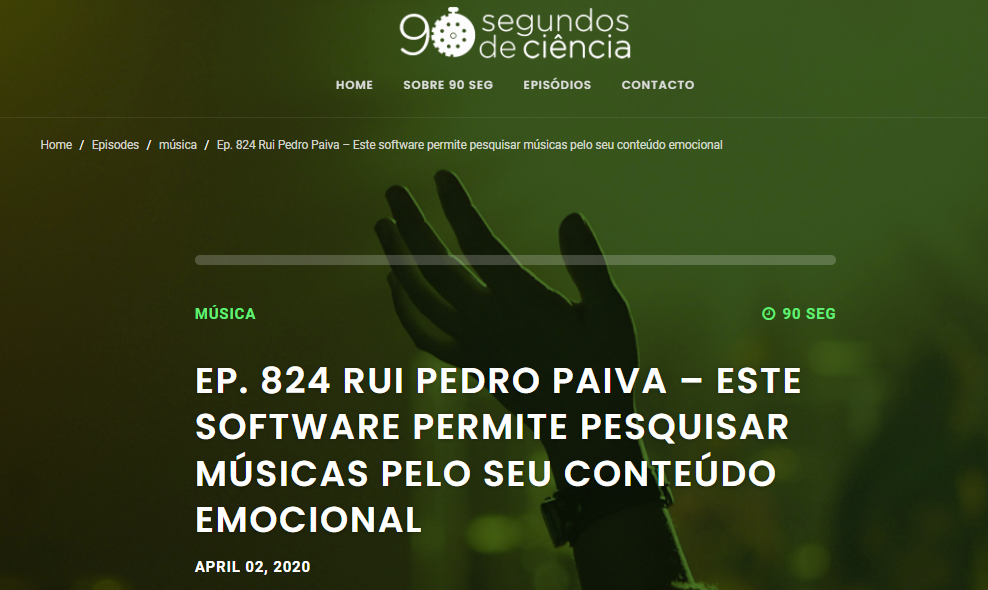
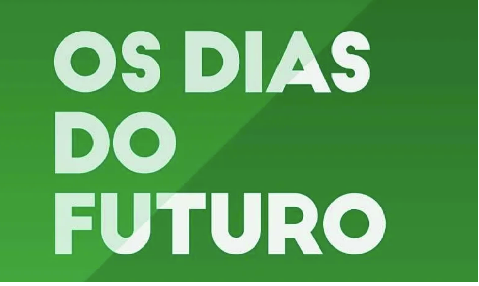

### In Media

<ul class="my-list">
  Information about our projects in the media:
</ul>
## <a href="/in_media2/" target="_blank">
<ul class="my-list">
  1. Interview with the Press Officer of the University of Coimbra about a computer program that evaluates emotions in music (audio + lyrics). This was later disseminated through various media channels. 2019. [<a href="/in_media2/" target="_blank">LINK</a>]
</ul>

     

---

## <a href="https://www.90segundosdeciencia.pt/episodes/ep-824-rui-pedro-paiva/" target="_blank">
<ul class="my-list">
  2. Professor Rui Pedro Paiva presents the MOODetector project, of which he is the coordinator, on the radio program "90 Seconds of Science" on Antena 1. 2020. [<a href="https://www.90segundosdeciencia.pt/episodes/ep-824-rui-pedro-paiva/" target="_blank">LINK</a>]
</ul>

    

---

## <a href="https://www.rtp.pt/play/p383/e419888/os-dias-do-futuro" target="_blank">
<ul class="my-list">
  3. Interview with Rui Pedro Paiva (my PhD supervisor) on the RTP Play program "Os Dias do Futuro," where he references my PhD work. The interview is from minute 20'22'' until the end. 2019. [<a href="https://www.rtp.pt/play/p383/e419888/os-dias-do-futuro" target="_blank">LINK</a>]
</ul>

    

